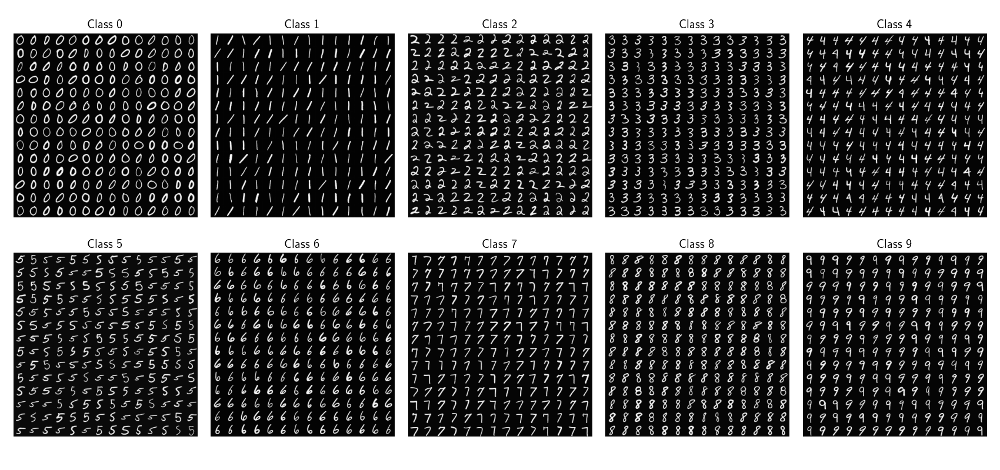
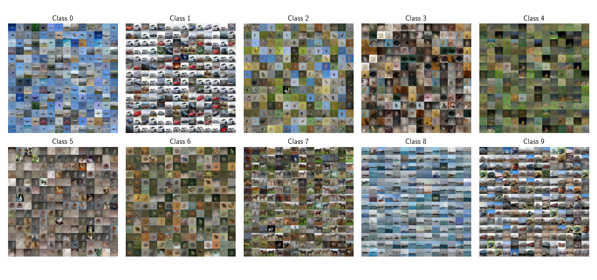

# genSFDI
## Description
Code for [**'Modeling and synthesis of breast cancer SFDI scatter signatures with generative models'**](https://doi.org/10.1109/tmi.2021.3064464) 

(DOI: https://doi.org/10.1109/tmi.2021.3064464). 

## Installation, requirements

Requirements are specified in `./requirements.txt`. TensorFlow 1.14 or above is required; we use the version provided by NVIDIA, i.e. [`nvidia-tensorflow[horovod]`](https://github.com/NVIDIA/tensorflow).

We recommend using a virtual environment and installing `./core-modules` after all requirements are met, with 

```
$ pip install -e ./core-modules
```

The folder `projects/genSFDI` contains a series of examples and tutorials to train and use the models shown in the article. However, if you have any questions, or something doesn't work in the code, please feel free to contact us!

A sequence of instructions are provided in `1_prepare_environment.sh` and `2_autoinstall_libs.sh`.

In order to verify the installation, we recommend testing it with 

```$ python ./core-modules/ai/autoencoders/mlpInfoSCVAE.py```

in a Python/IPython console that allows `matplotlib` figures to pop up and update.

## Repository history

### Update -- March 10, 2021
We are happy to announce that the manuscript was accepted! As shown in the article, we cannot provide patient data. To compensate for that, we will prepare ad-hoc experiments for the MNIST and CIFAR-10 datasets. We're currently preparing code and uploading it here, hopefully in the coming days. 

The plan is to also provide you with pre-trained models so you don't have to train them to see the results. They will not be as large as those in the article, but they should suffice to produce the same results on these tiny image datasets.

We appreciate your patience!

### Update -- March 24, 2021
This first commit includes all networks used in the manuscript, properly documented and with stand-alone simulations on the MNIST dataset. 

* Individual networks can be tested as a standalone scripts.
* Optical properties extraction with a neural LUT in both diffuse and subdiffuse regimes have been included. A training schedule is given in `./projects/gensfdi/compute/train_op_estimator.py` and a demonstrator is provided at `./projects/gensfdi/plotting/show_op_extraction.py`.
* Older autoencoders are located in `./core-modules/ai/other_nets/`.
* Functions for combining diffuse and subdiffuse-regime functions are provided in `./core-modules/utils/sfdi`.

A final version of this code will include:
* Pretrained models for MNIST and CIFAR-10
* Training schedules used for these models
* Demonstrators of the essential operations allowed by the z-clamped convolutional InfoVAE.

Due to compute limitations, this may unfortunately take a few days. 

### Last update -- July 29, 2021




We finally had access to some free compute -- you will find pretrained models for you to experiment at `./output/networks`. I have laid out a few comments on the results for MNIST and CIFAR-10, in their corresponding scripts at `./projects/gensfdi/analysis`. In any case, if you have any problems installing or running the pretrained networks, let me know at `arturo.pardo@unican.es`.

## Cite this work! :)
If you use this code or any of its modules, please cite us on your paper!

```
@ARTICLE{9371720,
  author={A. {Pardo} and S. S. {Streeter} and B. W. {Maloney} and J. A. {Gutiérrez-Gutiérrez} and D. M. {McClatchy} and W. A. {Wells} and K. D. {Paulsen} and J. M. {López-Higuera} and B. W. {Pogue} and O. M. {Conde}},
  journal={IEEE Transactions on Medical Imaging}, 
  title={Modeling and synthesis of breast cancer optical property signatures with generative models}, 
  year={2021},
  volume={},
  number={},
  pages={1-1},
  doi={10.1109/TMI.2021.3064464}}
```


